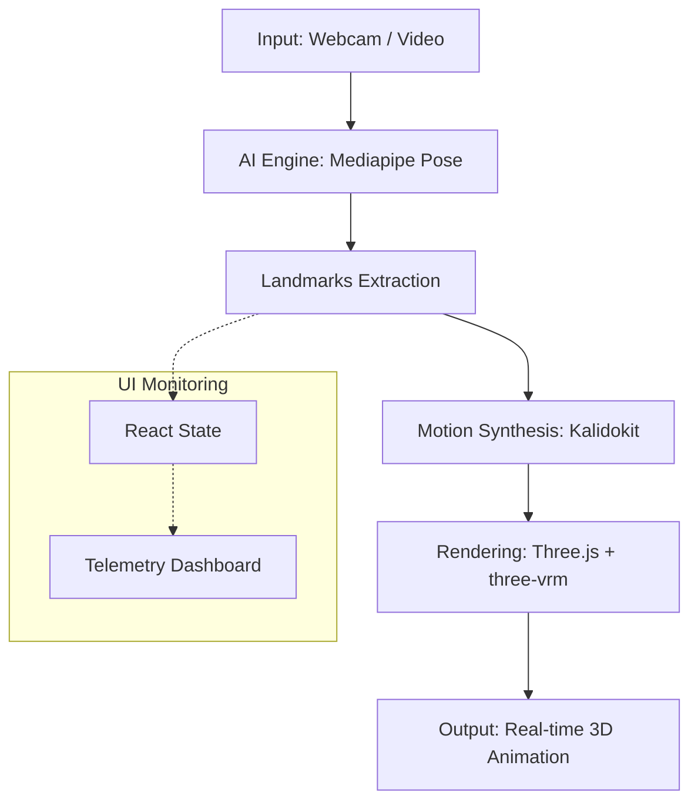

# DepthCapture System Architecture

このドキュメントでは、本プロジェクトにおける姿勢推定（Pose Estimation）および 3D モーションキャプチャーのシステム構成について解説します。

## 1. 全体俯瞰
本システムは、ブラウザ上でリアルタイムにポーズ推定を行い、VRM（3Dアバター）を同期・制御するための Web スタックで構成されています。

---

## 2. コンポーネント構成

### A. AI エンジン層 (Mediapipe Pose)
- **役割**: 画像フレームから身体の 33 個のランドマーク（座標）を抽出します。
- **特徴**: 
    - **Global Singleton**: WASM の初期化エラー（`Module.arguments`）を防ぐため、アプリ全体で一つのインスタンスを使い回すシングルトンパターンを採用。
    - **WebWorker / WASM**: CPU/GPU を活用した高速な推論。

### B. モーション合成層 (Kalidokit)
- **役割**: Mediapipe が出力した 2D/3D 座標を、VRM 規格（Humanoid）が理解できる **回転クォータニオン** に変換（Rigging）します。
- **特徴**:
    - **Inverse Kinematics (IK) の近似**: 関節の角度を計算し、不自然な曲がりを抑制。
    - **Smoothing**: 特徴点のブレを補正し、滑らかな動きを実現。

### C. レンダリング層 (Three.js & @pixiv/three-vrm)
- **役割**: 3D モデルを表示し、ボーンの回転を反映します。
- **特徴**:
    - **WebGL 2.0**: 高性能なグラフィックス描画。
    - **OrbitControls**: ユーザーによる自由な視点操作。
    - **Animation Loop**: 毎フレーム `VRM.update()` を呼び出し、ボーンの回転と物理演算（髪揺れ等）を処理。

### D. UI / 管理層 (React)
- **役割**: ユーザーインターフェース、ファイル管理、計測データの表示。
- **特徴**:
    - **テレメトリ監視**: 信頼度（Confidence）、レイテンシ（Latency）、スループット（Flux）のリアルタイム表示。
    - **ライフサイクル制御**: カメラの起動停止、VRM の動的ロード管理。

---

## 3. データフロー

1. **Capture**: ブラウザ経由での録画、または `Camera` ユーティリティによるウェブカメラストリームの取得。
2. **Detection**: `pose.send({image: video})` により AI エンジンへフレームを送信。
3. **Dispatch**: 推論結果が `activeResultsCallback` を通じて `MotionCapturer` コンポーネントへ到達。
4. **Solving**: `Kalidokit.Pose.solve` がランドマークをポーズベクトルへ変換。
5. **Syncing**: `vrm.humanoid.getNormalizedBoneNode(boneName)` を通じて Three.js 空間内のボーンを回転。
6. **Rendering**: レンダラーが最終的な 3D 映像をキャンバスに描画。

---

## 4. 修正済みのクリティカルな設計
以前発生していた「VRM 読み込み時の停止問題」を解決するため、以下の非同期設計を導入しています：

- **Decoupled Life Cycle**: カメラ（センシング）の起動周期と、VRM（レンダリング対象）のロード周期を完全に分離。
- **Stable References**: `useRef` を使用したコールバック管理により、プロップス更新に伴う AI エンジンの再初期化を防止。
